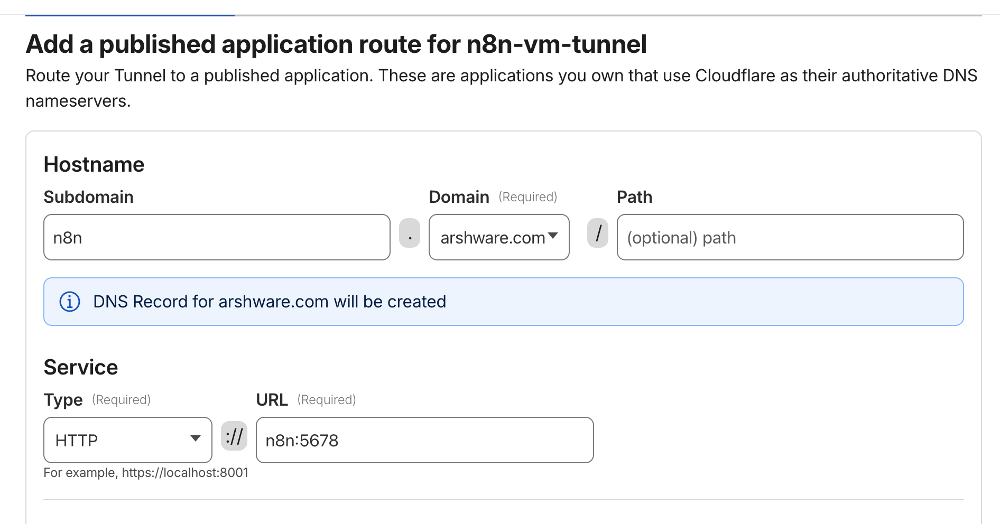

# Cloudflare Tunnel Creation Guide (VM)

## Summary
- **Goal:** Create a Cloudflare Tunnel and get the token for the VM.
- **Scope:** Cloudflare dashboard steps only.
 - **Security:** Token is used on the VM at runtime only; never store it in files.

## Preconditions
- You have access to the Cloudflare account and Zero Trust dashboard.
- Your domain is active in Cloudflare DNS.

## Recommended Name
- **Tunnel name:** `n8n-vm-tunnel`

## Steps (Cloudflare Dashboard)
1) Go to Cloudflare Dashboard → Zero Trust.
2) Left menu → **Networks** → **Connectors**.
3) Click **Add tunnel**.
4) Choose **Cloudflared** connector.
5) Name the tunnel `n8n-vm-tunnel`.
6) Create the tunnel.
7) On the **Install and run a connector** screen, copy the **Tunnel token** (do not run the command).

## Create DNS Route (Public Hostname)
1) In the tunnel details, go to **Public Hostnames**.
2) Add a hostname:
   - Subdomain: `n8n` (or your preferred name)
   - Domain: your domain (example: `arshware.com`)
   - Path: leave blank
3) Service URL:
   - If tunnel runs in Docker: `http://n8n:5678`
   - If tunnel runs on the VM host: `http://localhost:5678`
   - **Why:** `n8n:5678` only resolves inside the Docker network. Use `localhost:5678` only if cloudflared runs on the VM host and n8n is bound to the host.
   - **HTTP vs HTTPS:** Use **HTTP** here. Cloudflare handles HTTPS for public traffic; the origin inside your VM/Docker network should be plain HTTP.
4) Save.



## Where to Use the Token
- On the VM, export it before running the install script:
```bash
export CLOUDFLARE_TUNNEL_TOKEN="<your-tunnel-token>"
```
- Do not store the token in `config.yml` or `.env` files.
